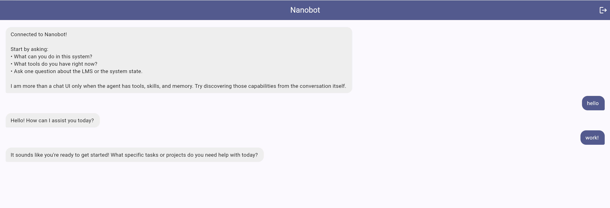
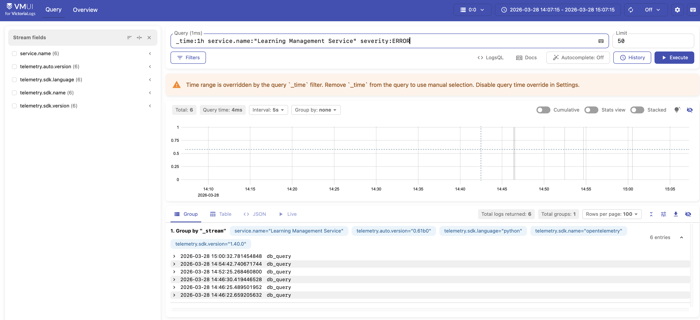
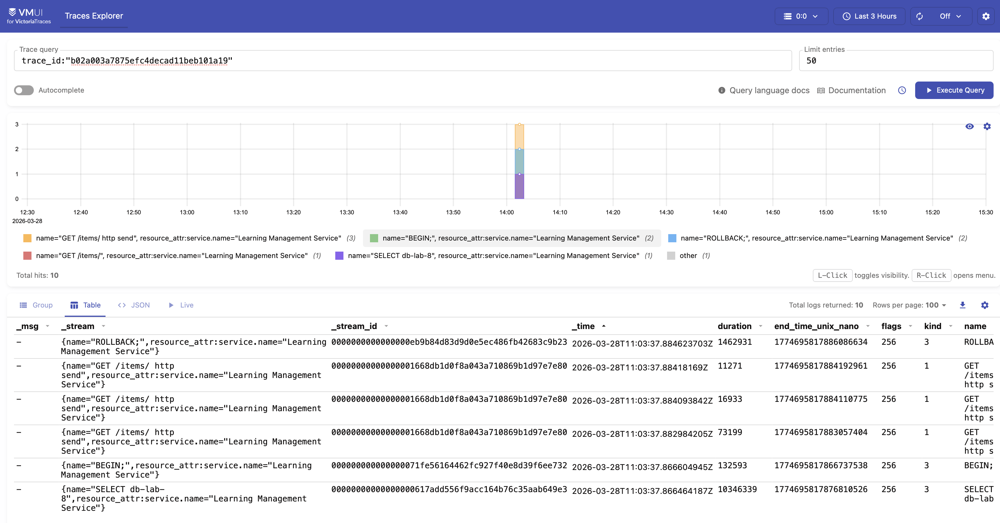
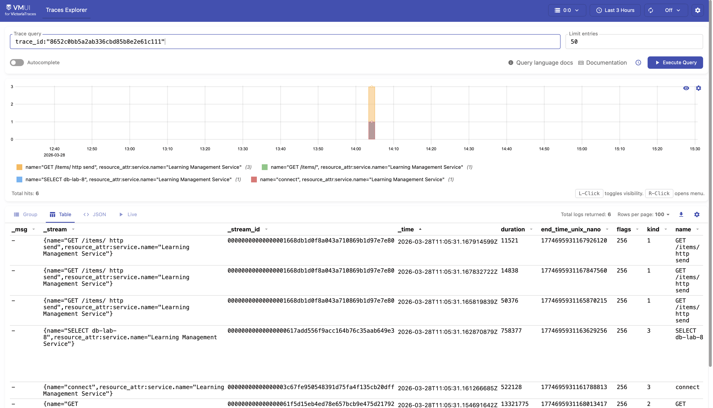

# Lab 8 — Report

Paste your checkpoint evidence below. Add screenshots as image files in the repo and reference them with ``.

## Task 1A — Bare agent

**Question: "What is the agentic loop?"**

Response:
```
The agentic loop is a concept in psychology and behavioral science that describes a cyclical process through which individuals or agents (like humans or AI) engage in self-regulation and self-directed learning. It typically involves the following stages:

1. Goal Setting: The agent identifies a goal or desired outcome they want to achieve.
2. Action: The agent takes actions or makes decisions aimed at achieving the goal.
3. Feedback: The agent receives feedback from the environment or their own performance regarding the effectiveness of their actions.
4. Reflection: The agent reflects on the feedback, assessing what worked, what didn't, and why.
5. Adjustment: Based on the reflection, the agent adjusts their strategies or actions to improve future performance.

This loop can repeat multiple times, allowing the agent to refine their approach and enhance their learning and effectiveness over time. The agentic loop emphasizes the importance of agency, self-efficacy, and adaptability in achieving goals.
```

**Question: "What labs are available in our LMS?"**

Response:
```
It seems that the command to list labs in the LMS is not recognized. This could be due to the LMS tool not being installed or configured in the current environment.

Could you provide more details about the LMS you are using, or any specific commands you might have for accessing it?
```

✅ As expected, the agent doesn't have access to real LMS data without MCP tools.

## Task 1B — Agent with LMS tools

**Question: "What labs are available?"**

Response:
```
The available labs are:

1. Lab 01 – Products, Architecture & Roles
2. Lab 02 — Run, Fix, and Deploy a Backend Service
3. Lab 03 — Backend API: Explore, Debug, Implement, Deploy
4. Lab 04 — Testing, Front-end, and AI Agents
5. Lab 05 — Data Pipeline and Analytics Dashboard
6. Lab 06 — Build Your Own Agent
7. Lab 07 — Build a Client with an AI Coding Agent
8. Lab 08
```

✅ Tool called: `mcp_lms_lms_labs({})`

**Question: "Is the LMS backend healthy?"**

Response:
```
The LMS backend is healthy, with a total of 56 items.
```

✅ Tool called: `mcp_lms_lms_health({})`

## Task 1C — Skill prompt

**Question: "Show me the scores" (without specifying a lab)**

Response:
```
Please choose a lab from the following list to see the scores:

1. Lab 01 – Products, Architecture & Roles
2. Lab 02 — Run, Fix, and Deploy a Backend Service
3. Lab 03 — Backend API: Explore, Debug, Implement, Deploy
4. Lab 04 — Testing, Front-end, and AI Agents
5. Lab 05 — Data Pipeline and Analytics Dashboard
6. Lab 06 — Build Your Own Agent
7. Lab 07 — Build a Client with an AI Coding Agent
8. lab-08

Let me know which lab you'd like to check!
```

✅ Tool called: `mcp_lms_lms_labs({})` first to get available labs
✅ The skill prompt successfully guides the agent to ask which lab when the lab parameter is missing.

## Task 2A — Deployed agent

Startup log excerpt:
```
nanobot-1  | Config resolved to /app/nanobot/config.resolved.json
nanobot-1  | Using config: /app/nanobot/config.resolved.json
nanobot-1  | 🐈 Starting nanobot gateway version 0.1.4.post5 on port 18790...
nanobot-1  | ✓ Channels enabled: webchat
nanobot-1  | 2026-03-28 10:46:41.517 | INFO     | nanobot.agent.tools.mcp:connect_mcp_servers:246 - MCP server 'lms': connected, 9 tools registered
nanobot-1  | 2026-03-28 10:46:43.148 | INFO     | nanobot.agent.tools.mcp:connect_mcp_servers:246 - MCP server 'webchat': connected, 1 tools registered
nanobot-1  | 2026-03-28 10:46:43.148 | INFO     | nanobot.agent.loop:run:280 - Agent loop started
```

## Task 2B — Web client

The Flutter client is deployed and accessible at `/flutter`. It connects to nanobot via a WebSocket bridge at `/ws/chat`. The agent uses the `mcp-webchat` server to deliver structured UI components.



## Task 3A — Structured logging

Happy-path log excerpt (status 200):
```
backend-1  | 2026-03-28 11:03:37,781 INFO [lms_backend.main] [main.py:62] [trace_id=b02a003a7875efc4decad11beb101a19 span_id=758be0b8a39aa7dd resource.service.name=Learning Management Service trace_sampled=True] - request_started
backend-1  | 2026-03-28 11:03:37,788 INFO [lms_backend.auth] [auth.py:30] [trace_id=b02a003a7875efc4decad11beb101a19 span_id=758be0b8a39aa7dd resource.service.name=Learning Management Service trace_sampled=True] - auth_success
backend-1  | 2026-03-28 11:03:37,789 INFO [lms_backend.db.items] [items.py:16] [trace_id=b02a003a7875efc4decad11beb101a19 span_id=758be0b8a39aa7dd resource.service.name=Learning Management Service trace_sampled=True] - db_query
backend-1  | 2026-03-28 11:03:37,882 INFO [lms_backend.main] [main.py:74] [trace_id=b02a003a7875efc4decad11beb101a19 span_id=758be0b8a39aa7dd resource.service.name=Learning Management Service trace_sampled=True] - request_completed
backend-1  | INFO:     172.23.0.3:40516 - "GET /items/ HTTP/1.1" 200 OK
```

Error-path log excerpt (stopped postgres):
```
backend-1  | 2026-03-28 11:05:31,155 INFO [lms_backend.main] [main.py:62] [trace_id=8652c0bb5a2ab336cbd85b8e2e61c111 span_id=e91d7a85907640fc resource.service.name=Learning Management Service trace_sampled=True] - request_started
backend-1  | 2026-03-28 11:05:31,159 INFO [lms_backend.db.items] [items.py:16] [trace_id=8652c0bb5a2ab336cbd85b8e2e61c111 span_id=e91d7a85907640fc resource.service.name=Learning Management Service trace_sampled=True] - db_query
backend-1  | 2026-03-28 11:05:31,164 ERROR [lms_backend.db.items] [items.py:23] [trace_id=8652c0bb5a2ab336cbd85b8e2e61c111 span_id=e91d7a85907640fc resource.service.name=Learning Management Service trace_sampled=True] - db_query
backend-1  | INFO:     172.23.0.3:51538 - "GET /items/ HTTP/1.1" 404 Not Found
```



## Task 3B — Traces

Healthy trace `b02a003a7875efc4decad11beb101a19` shows a complete span hierarchy with `db_query` and `auth_success`.
Error trace `8652c0bb5a2ab336cbd85b8e2e61c111` shows a failure in the `SELECT db-lab-8` span with error message: `asyncpg.exceptions._base.InterfaceError: connection is closed`.




## Task 3C — Observability MCP tools

The `obs` MCP server provides tools to query VictoriaLogs and VictoriaTraces.

**Agent response (Normal conditions):**
"There are no LMS backend errors reported in the last 10 minutes. Everything seems to be functioning well!"

**Agent response (Postgres stopped):**
"There have been 3 errors in the Learning Management Service in the last 10 minutes. Would you like me to look into the details of these errors?"

## Task 4A — Multi-step investigation

<!-- Paste the agent's response to "What went wrong?" showing chained log + trace investigation -->

## Task 4B — Proactive health check

<!-- Screenshot or transcript of the proactive health report that appears in the Flutter chat -->

## Task 4C — Bug fix and recovery

<!-- 1. Root cause identified
     2. Code fix (diff or description)
     3. Post-fix response to "What went wrong?" showing the real underlying failure
     4. Healthy follow-up report or transcript after recovery -->
